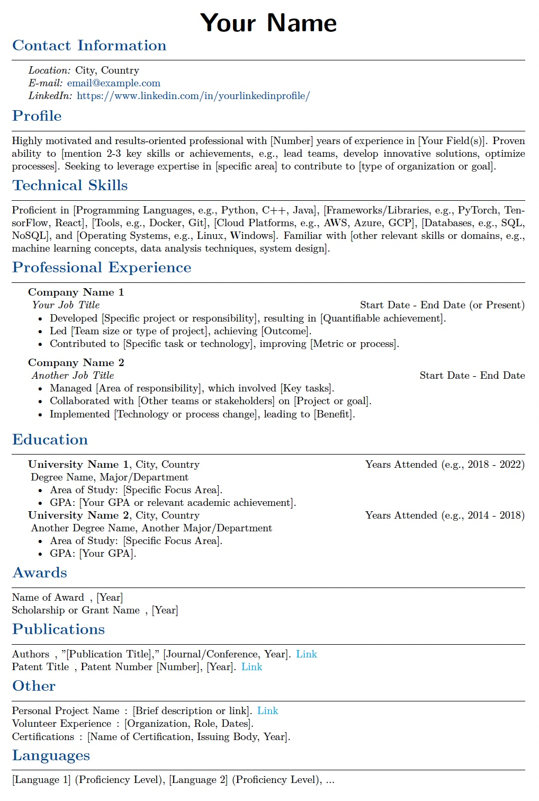

# Minimalist LaTeX CV Template with GitHub action to render in pdf

This repository provides a clean and customizable LaTeX template for creating your professional curriculum vitae (CV). Based on a proven personal CV structure, this template focuses on clarity, readability, and easy modification.

## Features

* **Clean & Minimalist Design:** A simple, professional layout that highlights your content.
* **Customizable Sections:** Easily add, remove, or reorder sections (Contact, Profile, Skills, Experience, Education, Awards, Publications, etc.).
* **Adjustable Margins:** Uses the `geometry` package for easy margin configuration.
* **Hyperlinks:** Automatically handles email and web links using the `hyperref` package.
* **Color Customization:** Defines a custom color for section titles, easily changeable.
* **Compact Lists:** Uses `paralist` for space-efficient lists within experience and education entries.
* **No Page Numbers (by default):** Designed for shorter CVs, but can be easily enabled.

## Getting Started

These instructions will help you get a copy of the template up and running for your own use.

### Prerequisites

You need a LaTeX distribution installed on your system. Popular options include:

* [**TeX Live**](https://www.tug.org/texlive/) (Recommended for most platforms)
* [**MiKTeX**](https://miktex.org/) (Popular on Windows)
* [**MacTeX**](https://www.tug.org/mactex/) (For macOS)

You can also use online LaTeX editors like [Overleaf](https://www.overleaf.com/), which do not require local installation.

## Customization

* **Colors:** Modify the `sectionblue` color definition at the beginning of the document (`\definecolor{sectionblue}{RGB}{0, 70, 140}`).
* **Margins:** Adjust the values in the `\usepackage[left=0.8in,right=0.8in,top=0.8in,bottom=0.8in]{geometry}` line.
* **Fonts:** Change the font packages used (e.g., replace `lmodern` with others, but be mindful of system availability or include necessary font files).
* **Sections:** Add new `\cvsection{New Section Title}` commands, or remove sections you don't need. Follow the existing structure for content within sections.
* **Page Numbers:** Uncomment the lines related to `\pagestyle{fancy}`, `\fancyhf{}`, `\renewcommand{\headrulewidth}{0pt}`, and `\fancyfoot[C]{\arabic{page} of \pageref*{LastPage}}` near the beginning of the document.